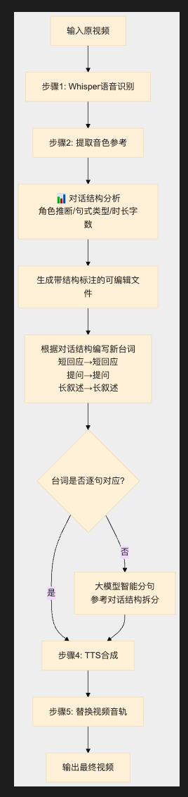

# 视频语音替换工具 — 使用指南

> 替换视频中的语言内容，保持原音色不变。

## 目录

- [功能简介](#功能简介)
- [环境要求](#环境要求)
- [安装](#安装)
- [快速开始](#快速开始)
- [完整使用流程](#完整使用流程)
- [命令行参数](#命令行参数)
- [技术架构](#技术架构)
- [常见问题](#常见问题)

---

## 功能简介

本工具可以将视频中的语音内容替换为新的文字内容，同时**保持原视频中说话人的音色不变**。

核心能力：

- **🔥 主题创作**：只需给一个方向/主题，大模型根据原视频时间轴自动创作全新台词（最推荐）
- **智能分句**：接入大模型（已内置 HAI 平台 DeepSeek-V3.1，开箱即用），自动将自由格式的新台词按原视频节奏拆分
- **语音识别**：自动提取视频中的语音并转写为文字（Whisper）
- **音色提取**：从原视频中智能筛选最佳参考片段，分离纯净人声（Demucs）
- **背景音处理**：自动分离并混合背景音乐（BGM），同时抑制观众笑声等瞬态杂音
- **声音克隆**：用原音色朗读新内容（Qwen3-TTS）
- **时间轴对齐**：新语音按原视频的时间节奏精确插入，保持画面与语音同步
- **视频合成**：将新音频无损替换回原视频（FFmpeg）

### 三种台词模式

| 模式 | 参数 | 台词来源 | 推荐度 |
|------|------|----------|--------|
| 🔥 **主题创作** | `--topic "主题方向"` | **大模型根据原视频时间轴自动创作全新台词** | ⭐⭐⭐ 最推荐 |
| 自由文本 | `--new_text 文件路径` | 用户提供一整段文本，大模型自动分句对齐 | ⭐⭐ |
| 手动编辑 | 编辑 `transcript_for_edit.md` | 用户逐句手写/修改 | ⭐ |

---

## 环境要求

### 系统依赖

| 依赖 | 用途 | 安装方式 |
|------|------|----------|
| **FFmpeg** | 音视频处理 | `brew install ffmpeg`（macOS） |
| **Python 3.8+** | 运行环境 | 推荐 3.10+ |

### 硬件建议

| 配置项 | 最低要求 | 推荐配置 |
|--------|----------|----------|
| 内存 | 8 GB | 16 GB+ |
| 显卡 | 无（CPU 可运行） | NVIDIA GPU（CUDA 加速） |
| 磁盘 | 5 GB（模型缓存） | 10 GB+ |

> **提示**：首次运行时会自动下载 Whisper 和 Qwen3-TTS 模型，请确保网络畅通。

---

## 安装

### 方式一：开发模式安装（推荐）

```bash
cd voice_replace_project

# 安装核心依赖
pip install -e .

# 安装全部可选依赖（含 Demucs 人声分离 + edge-tts 备选引擎）
pip install -e ".[all]"
```

### 方式二：仅安装依赖

```bash
cd voice_replace_project
pip install -r requirements.txt
```

### 验证安装

```bash
# 检查命令是否可用（方式一安装后）
voice-replace --help

# 或通过模块方式运行
python -m voice_replace --help
```

---

## 快速开始

### 🔥 最推荐 — 主题创作（全自动，无需写台词）

只需给一个方向/主题，大模型会**根据原视频的时间轴和对话结构自动创作全新台词**（已内置 HAI 平台 API Key，开箱即用）：

```bash
# 最简用法 — 只给一个主题，大模型自动创作！
voice-replace --input video.mp4 --output_dir output \
    --topic "关于程序员代码bug的搞笑笑话"

# 指定使用其他 HAI 平台模型
voice-replace --input video.mp4 --output_dir output \
    --topic "介绍人工智能技术的发展历程" --llm_model Kimi-K2.5

# 使用外部大模型（如 OpenAI）
voice-replace --input video.mp4 --output_dir output \
    --topic "聊聊量子计算的未来" \
    --llm_api_key sk-xxx \
    --llm_base_url https://api.openai.com/v1 \
    --llm_model gpt-4o-mini
```

> 你不需要写任何台词，也不需要关心原视频有几句话、每句话的时间点在哪里。大模型会自动分析原视频结构，创作出匹配原视频节奏的全新台词。

### 🚀 方式二 — 自由文本（大模型自动分句）

如果你已经有一段想说的内容，直接给工具，大模型自动按原视频节奏拆分：

```bash
voice-replace --input video.mp4 --output_dir output \
    --new_text my_script.txt
```

### ✏️ 方式三 — 手动编辑（精确控制）

如果你希望精确控制每一句台词，可以手动编辑：

```bash
# 第一步：提取原视频的文字和音色
voice-replace --input 原始视频.mp4 --output_dir output

# 第二步：手动编辑 output/transcript_for_edit.md 后，生成新视频
voice-replace --input 原始视频.mp4 --output_dir output \
    --new_text output/transcript_for_edit.md --skip_extract
```

---

## 完整使用流程

### 方式一：主题创作（最推荐 🔥）

只需一步：**给一个主题** → **运行工具**，大模型自动创作台词并生成新视频。

```bash
voice-replace --input video.mp4 --output_dir output \
    --topic "关于程序员代码bug的搞笑笑话"
```

工具会自动完成以下全部步骤：

1. **语音识别**：用 Whisper 提取原视频的语音文字和时间戳
2. **音色提取**：用 Demucs 分离人声，智能筛选最佳参考片段
3. **🧠 大模型创作台词**：分析原视频的对话结构（几句话、每句多长、哪些是短回应、哪些是长叙述），根据你给的主题方向自动创作匹配原视频节奏的全新台词
4. **声音克隆合成**：用 Qwen3-TTS 以原音色朗读新台词，按时间轴精确对齐
5. **视频合成**：FFmpeg 将新音频替换回原视频

最终输出：`output/video_replaced.mp4`

> **核心优势**：你不需要写任何一句台词。大模型会保持对话的自然感 — 短句对短句、提问对提问、感叹对感叹。

---

### 方式二：自由文本（大模型智能分句 ⭐）

如果你已经有想说的内容，只需两步：**准备新台词** → **运行工具**，大模型自动完成分句对齐。

#### 第一步：准备新台词

创建一个文本文件（如 `my_script.txt`），写入你想要的新台词内容。**无需关心分句和时间对齐**，直接写一整段即可：

```text
大家好，今天我想和大家聊聊深度学习的最新进展。
过去一年里，大语言模型取得了令人瞩目的突破，
从 GPT-4 到开源的 LLaMA，再到国产的 DeepSeek，
每一个模型都在刷新我们对 AI 能力的认知。
```

#### 第二步：运行工具

```bash
voice-replace --input video.mp4 --output_dir output \
    --new_text my_script.txt
```

工具会自动完成以下全部步骤：

1. **语音识别**：用 Whisper 提取原视频的语音文字和时间戳
2. **音色提取**：用 Demucs 分离人声，智能筛选最佳参考片段
3. **🤖 大模型智能分句**：自动检测新台词格式，调用大模型按原视频节奏拆分
4. **声音克隆合成**：用 Qwen3-TTS 以原音色朗读新台词，按时间轴精确对齐
5. **视频合成**：FFmpeg 将新音频替换回原视频

最终输出：`output/video_replaced.mp4`

---

### 方式三：手动逐句编辑（精确控制）

如果你需要精确控制每一句台词的内容和对应时间，可以使用手动模式。

#### 第一步：提取文字和音色

```bash
voice-replace --input video.mp4 --output_dir output
```

执行后会自动完成语音识别和音色提取，输出文件：

```
output/
├── step1_transcribe/
│   ├── audio.wav              # 提取的音频
│   ├── transcript.txt         # 纯文本转写结果
│   ├── subtitles.srt          # SRT 字幕文件
│   └── transcript.json        # 带时间戳的 JSON
├── step2_voice/
│   ├── reference_voice.wav    # 参考音色片段
│   ├── reference_text.txt     # 参考片段文字
│   └── reference_info.json    # 参考片段详情
└── transcript_for_edit.md     # ⬅️ 可编辑的台词文件
```

#### 第二步：编辑台词

打开 `output/transcript_for_edit.md`，逐行替换为新台词：

```markdown
# --- 第 1 句 [0.00s - 3.50s] 原文: 大家好，欢迎来到今天的分享
大家好，今天我想和大家聊聊深度学习

# --- 第 2 句 [3.80s - 7.20s] 原文: 今天我们来聊一聊人工智能
过去一年里大语言模型取得了令人瞩目的突破
```

**编辑规则**：

- 每行非注释文字对应原视频的一个语句片段
- 直接修改每行文字即可，`#` 开头的注释行会被忽略
- **保持行数一致**可获得最佳时间对齐效果

#### 第三步：生成新视频

```bash
voice-replace --input video.mp4 --output_dir output \
    --new_text output/transcript_for_edit.md \
    --skip_extract
```

> `--skip_extract` 跳过已完成的提取步骤，直接进入合成阶段。

最终输出：`output/video_replaced.mp4`

---

## 命令行参数

| 参数 | 必填 | 默认值 | 说明 |
|------|------|--------|------|
| `--input` | ✅ | — | 输入视频文件路径 |
| `--output_dir` | ✅ | — | 输出目录 |
| `--topic` | ❌ | — | 新台词的主题/方向（🔥 最推荐，大模型自动创作台词） |
| `--new_text` | ❌ | — | 新台词文件路径（不提供时仅执行提取） |
| `--output` | ❌ | `<原文件名>_replaced.mp4` | 最终输出视频路径 |
| `--language` | ❌ | `zh` | 视频语言代码（zh/en/ja 等） |
| `--whisper_model` | ❌ | `base` | Whisper 模型（tiny/base/small/medium/large） |
| `--speaker` | ❌ | `Vivian` | 预设音色（无参考音频时使用） |
| `--speed_factor` | ❌ | `1.0` | 语速倍率（建议 1.15-1.3 加快语速） |
| `--bgm_volume` | ❌ | `0.15` | 背景音音量比例（0.0~1.0，设为 0 等同禁用） |
| `--no_bgm` | ❌ | `false` | 禁用背景音混合（仅保留新语音） |
| `--skip_extract` | ❌ | `false` | 跳过步骤 1-2（已有提取结果时使用） |
| `--llm_api_key` | ❌ | 内置 HAI Key | 大模型 API Key（已内置，通常无需设置） |
| `--llm_base_url` | ❌ | HAI 平台 | 大模型 API Base URL（已内置，通常无需设置） |
| `--llm_model` | ❌ | `DeepSeek-V3.1` | 大模型名称（HAI 平台可用模型见下表） |
| `--force_adapt` | ❌ | `false` | 强制使用大模型适配台词（即使行数已匹配） |

### Whisper 模型选择

| 模型 | 大小 | 速度 | 精度 | 适用场景 |
|------|------|------|------|----------|
| `tiny` | 39 MB | ⚡⚡⚡ | ★★ | 快速测试 |
| `base` | 74 MB | ⚡⚡ | ★★★ | **日常使用（推荐）** |
| `small` | 244 MB | ⚡ | ★★★★ | 较高精度需求 |
| `medium` | 769 MB | 🐢 | ★★★★★ | 高精度需求 |
| `large` | 1.5 GB | 🐢🐢 | ★★★★★ | 最高精度 |

### Qwen3-TTS 预设音色

| 音色名 | 描述 |
|--------|------|
| `Vivian` | 明亮的年轻女声 |
| `Serena` | 温暖、温柔的年轻女声 |
| `Uncle_Fu` | 成熟的男性声音，醇厚音色 |
| `Dylan` | 年轻的北京男声 |
| `Eric` | 活泼的成都男声 |
| `Ryan` | 富有节奏感的英文男声 |
| `Aiden` | 阳光的美国男声 |
| `Ono_Anna` | 俏皮的日本女声 |
| `Sohee` | 温暖的韩国女声 |

---

## 技术架构

### 处理流程

```
输入视频 + 主题方向 / 新台词文本
  │
  ├─ 步骤 1：Whisper 语音识别 ──→ 文字 + 时间戳
  │
  ├─ 步骤 2：Demucs 人声分离 ──→ 参考音色片段 + 背景音（BGM）
  │     └─ 抑制观众笑声等瞬态杂音
  │
  ├─ 步骤 3：🧠 大模型智能处理（自动）
  │     ├─ 主题创作模式：根据主题 + 原视频对话结构，自动创作全新台词
  │     └─ 自由文本模式：分析原视频的分句结构，将用户台词按原视频节奏智能拆分
  │
  ├─ 步骤 4：Qwen3-TTS 时间轴对齐合成
  │     ├─ 逐句 TTS 生成（克隆原音色）
  │     ├─ 按原始时间点插入
  │     ├─ 静音填充对齐
  │     ├─ 超时自动变速
  │     └─ 混合处理后的背景音（可调音量）
  │
  └─ 步骤 5：FFmpeg 音轨替换 ──→ 输出视频
```

### 模块依赖关系

```
cli.py（命令行入口）
  ├── transcriber.py      ← Whisper 语音识别
  ├── voice_extractor.py  ← Demucs 音色提取
  ├── dialogue_analysis.py ← 🔥 对话结构分析（主题创作模式）
  ├── timeline.py         ← 时间轴对齐引擎
  │     ├── text_adapter.py ← 大模型智能创作/分句
  │     ├── synthesizer.py  ← Qwen3-TTS / edge-tts
  │     ├── audio_utils.py  ← 静音生成、拼接、变速
  │     └── video_utils.py  ← FFmpeg 封装
  └── video_utils.py      ← FFmpeg 封装
```

### 核心技术栈

| 技术 | 用途 | 说明 |
|------|------|------|
| OpenAI Whisper | 语音识别 | 提取语音文字和时间戳 |
| Demucs | 人声分离 | 从混合音频中分离纯净人声 |
| Qwen3-TTS | 语音合成 | 声音克隆 + 文本转语音 |
| FFmpeg | 音视频处理 | 音轨提取、拼接、替换 |
| OpenAI API（可选） | 智能创作/分句 | 主题创作 + 自由格式台词按原视频节奏拆分 |
| HAI 大模型平台（内置） | 智能创作/分句 | 已内置 DeepSeek-V3.1，开箱即用 |

---


## 常见问题

### Q: 首次运行很慢？

首次运行需要下载模型文件：
- Whisper base 模型：约 74 MB
- Qwen3-TTS 模型：约 1-3 GB

模型会缓存到本地，后续运行无需重复下载。

### Q: 没有 GPU 能运行吗？

可以。工具会自动检测硬件环境：
- **NVIDIA GPU**：使用 CUDA 加速（最快）
- **Apple Silicon**：使用 MPS 加速
- **CPU**：纯 CPU 推理（较慢但可用）

### Q: 不想自己写台词怎么办？

**最推荐方案：使用 `--topic` 主题创作模式**。只需给一个方向，大模型自动创作：

```bash
# 只给一个主题，大模型自动创作全新台词！
voice-replace --input video.mp4 --output_dir output \
    --topic "关于程序员代码bug的搞笑笑话"
```

大模型会分析原视频的对话结构（几句话、每句多长、节奏如何），然后根据你的主题自动创作匹配的台词。

### Q: 已经有台词但行数和原始片段不一致怎么办？

**使用 `--new_text` 自由文本模式**，大模型自动分句对齐：

```bash
# 直接给一整段新台词，大模型自动适配！
voice-replace --input video.mp4 --output_dir output \
    --new_text my_script.txt
```

**未配置大模型时的降级策略**：
- **行数多于原始片段**：多余的台词紧接在最后一个时间槽之后
- **行数少于原始片段**：多余的时间槽保持静音
- **建议**：尽量保持行数一致，以获得最佳时间对齐效果

### Q: 主题创作/智能分句支持哪些大模型？

支持所有兼容 OpenAI Chat Completions API 格式的大模型：

| 大模型 | `--llm_base_url` | `--llm_model` |
|--------|-------------------|---------------|
| **HAI 平台（内置默认）** | （已内置，无需设置） | `DeepSeek-V3.1`（默认）/ `Kimi-K2.5` / `Qwen3-235B-A22B` / `Qwen3-32B-FP8` |
| OpenAI | `https://api.openai.com/v1` | `gpt-4o-mini` / `gpt-4o` |
| DeepSeek | `https://api.deepseek.com/v1` | `deepseek-chat` |
| 通义千问 | `https://dashscope.aliyuncs.com/compatible-mode/v1` | `qwen-turbo` / `qwen-plus` |
| Ollama（本地） | `http://localhost:11434/v1` | `qwen2.5:7b` 等 |

安装依赖：`pip install openai`（或 `pip install -e ".[llm]"`）

> **优先级**：命令行参数 > 环境变量 > 内置默认值（HAI 平台）

### Q: 生成的语音有杂音？

工具内置了多重质量保障机制：
- 自动裁剪音频开头的杂音
- 质量检测不合格会自动重试（最多 3 次）
- 定期重载模型防止 KV cache 膨胀

如果仍有问题，可以尝试：
1. 使用更长的参考音频片段
2. 确保参考音频中没有背景噪音

### Q: 如何使用 edge-tts 替代 Qwen3-TTS？

edge-tts 是微软的在线 TTS 服务，无需 GPU，但不支持声音克隆：

```bash
# 安装 edge-tts
pip install edge-tts

# 在代码中使用（需修改 timeline.py 中的引擎初始化）
```

### Q: 支持哪些视频格式？

支持所有 FFmpeg 能处理的格式，包括但不限于：
- MP4、AVI、MKV、MOV、WMV、FLV、WebM

### Q: 如何只替换部分台词？

在编辑 `transcript_for_edit.md` 时，保持不需要修改的行原样不动即可。工具会对每一行都重新生成语音，但如果文字内容相同，效果与原视频基本一致。
